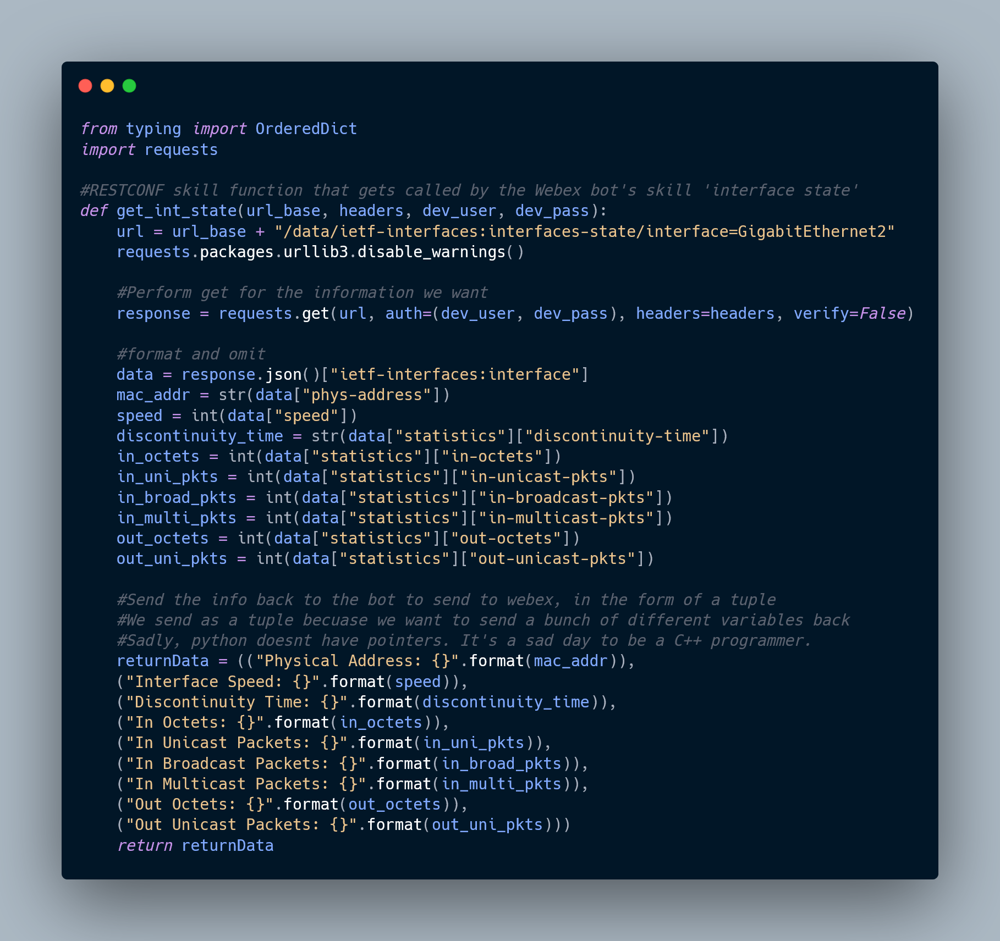

## Project Overview

This bot is designed interact and monitor the network on the following topology.
The requirements for this project were to have several different methods of interacting with the network. This includes one Netmiko skill, one RESTCONF skill, one Ansible skill, one Genie skill, and a disaster recovery skill.

With ansible, the bot enables and captures debuging logs. With netmiko, it captures the running configurations. With restconf, it obtain detailed information for the network interface GigabitEthernet2 port.


## Getting Started

The `WebexBot.py` file is the main file for this project. It contains the code that creates and adds skills to the Webex Teams bot. The skills are called from their own fils that all end in ...Test.py 

### Dependencies

There are several python modules that are required to replicate this project. Additionally, the bot uses ngrok to forward its requests from the Webex API to the python terminal.

* This was created on an Ubuntu Linux VM running these aformentioned modules. 
* Need the pip3 modules: Paramiko/Netmiko, RESTCONF/NETCONF, Ansible, and Python 
* The bot was created on developers.webex.com and can be used on teams.webex.com

### Setting up a Webex App (Bot)

1. Navigate to developers.webex.com and create an account
2. Sign into developers and navigate to [your webex apps](https://developer.webex.com/my-apps)
3. Create a new app
4. Select type Bot
5. Name your bot, give it an email and fill in other required fields
6. Save your bot's access token. It will be used when setting up the python files

### Installing

1. Download or pull the repo and unpack all contents in the same directory in your development environment

    

2. Open the `WebexBot.py` file in your IDE of choice

3. Replace the bot information on lines `36` through `39`
    - Make sure to use the bot's token on the `teams_token` variable

    ```
    ### Configure the Webex Teams Bot ###
    bot_email = '' #Fill in your Teams Bot email#
    teams_token = '' #Fill in your Teams Bot Token#
    bot_url = '' #Fill in the ngrok forwarding address#
    bot_app_name = '' #Give your bot a name#
    ```

* It is assumed you have two routers that are capeable of being managed by the tasks within this bot, and comform to the topology described before.

### Executing program

1. Start a new terminal and create your ngrok session using `ngrok http 5000`
     - This will host the forwarder through ngrok on your machine, keep this window open
2. Copy the https url and put in the `bot_url` variable from before
3. Run the Webex Bot using the command `python3 WebexBot.py` within Visual Studio
    - Ensure that your terminal is in the directory of all the other files. Ansible relies on this.
6. Proceed to teams.webex.com and begin messaging the bot using its email. Saying 'Hello' will prompt the bot to return its greeting message

    

7. Observe the output of the bot to ensure its functionality

    ```
    Message content:
    Webex Teams Message:
    {
        "id": "Y2lzY29zcGFyazovL3VybjpURUFNOnVzLXdlc3QtMl9yL01FU1NBR0UvNDMzOTE2OTAtNTdkOC0xMWVjLTk2ODYtMjk2NTczODc0Zjlj",
        "roomId": "Y2lzY29zcGFyazovL3VybjpURUFNOnVzLXdlc3QtMl9yL1JPT00vOGVhOTBjNzAtM2U5Ny0xMWVjLWEyZTctZDExZjkwZjI4Yjg2",
        "roomType": "direct",
        "text": "I have finished the execution of debug! The files are stored in my /debug-logs folder!",
        "personId": "Y2lzY29zcGFyazovL3VzL1BFT1BMRS8zMTRlZTJmMy03MDlmLTQyYjgtYjI0MS04Njc0OWJhMDc4Mjk",
        "personEmail": "benjamin_flinkerton@webex.bot",
        "markdown": "I have finished the execution of debug! The files are stored in my /debug-logs folder!",
        "html": "<p>I have finished the execution of debug! The files are stored in my /debug-logs folder!</p>",
        "created": "2021-12-08T03:38:09.401Z"
    }
    Ignoring message from our self
    127.0.0.1 - - [08/Dec/2021 03:38:11] "POST / HTTP/1.1" 200 -
    ```

## Pretty Code

__RESTCONF skill function__



## Common Help

* If the running config becomes too large, it gets saved to the following:

    ```
    ./runningConfigs/running_config_<ip>_<timecode>.txt
    ```

* Running __/help__ in the chatbox will return the skills. See example below:

    ```
    Hello!  I understand the following commands:

        /help: Get help.
        capture debug: Ansible Skill: Save the debug information to a file on host.
        interface state: RESTCONF SKill: Get interface state infromation about Gig2.
        show run: Netmiko Skill: Return running configuration on the router
    ```

## Authors

__Contributors names and contact info__

*Chase Heim*, 
*Chue Andy Yang*, 
*Cody Droes*, 

## Version History

* __0.1__
    * Initial Release

## License

This project is licensed under the MIT License - see the LICENSE file for details
